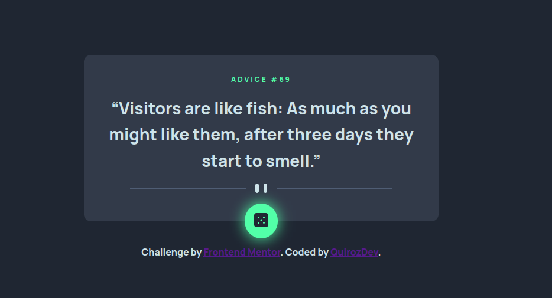

# Frontend Mentor - Advice Generator App

This is a solution to the <a href="https://www.frontendmentor.io/challenges/advice-generator-app-QdUG-13db" target="_blank">Advice Generator App challenge on Frontend Mentor</a>. Frontend Mentor challenges help you improve your coding skills by building realistic projects.

## Table of contents

- [Overview](#overview)
  - [The challenge](#the-challenge)
  - [Screenshot](#screenshot)
  - [Links](#links)
- [My process](#my-process)
  - [Built with](#built-with)
- [Author](#author)

## Overview

### The challenge

Users should be able to:

- View the optimal layout for the app depending on their device's screen size
- See hover states for all interactive elements on the page
- Generate a new piece of advice by clicking the dice icon

### Screenshot

### Links

- <a href="https://github.com/Quirozdev/Advice-Generator-Vue" target="_blank">Solution URL</a>
- <a href="https://quirozdev.github.io/Advice-Generator-Vue/" target="_blank">Live Site URL</a>

### Built with

- Vue 3 with the Composition API and TypeScript
- Use of composables for separation of concerns
- CSS custom properties
- Flexbox
- Responsive design

## Author

- GitHub - <a href="https://github.com/Quirozdev" target="_blank">Quirozdev</a>
